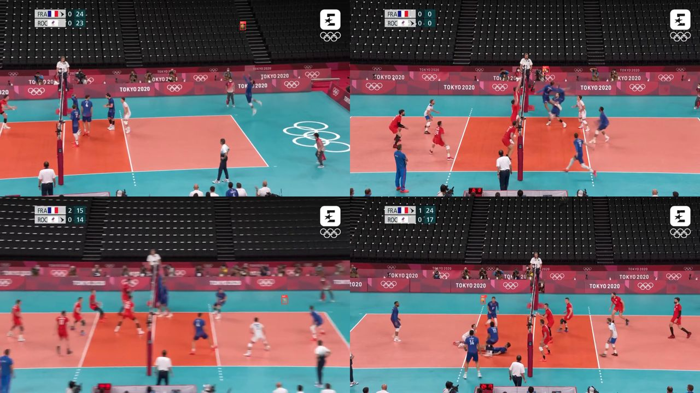

# YO-YOLO — Your Own YOLO

> Describe what you want to detect → auto-label with **NVIDIA Locate Anything 3B** → optionally review → train **YOLO** → inspect → deploy.

Turn a folder of images and a one-line object description into a fast,
deployable YOLO detector. A vision-language **teacher** (Locate Anything 3B)
auto-labels your images; a lightweight **YOLO11n student** learns from those
labels and runs orders of magnitude faster.

No manual annotation. No active learning. No complex agent planning — just
**describe → label → train → inspect.**

## Why yo-yolo exists

Foundation vision-language models can find *anything you can name* — but they
are far too slow and heavy to run on hours of video or on the edge. Training a
classic detector is fast at inference but needs labeled data, which is tedious.

yo-yolo bridges the two: **use the slow generalist once, as a labeler, and
distill it into a fast specialist you actually deploy.** You bring a folder of
images and a sentence; you get a `best.pt` that runs in ~10 ms.

Because the whole pipeline is plain scripts driven by an agent skill (or one
command), it is flexible: the detector is just the middle. Before it you can
plug in *any* frame source (video sampling, cameras, web scrapes); after it
you can build *any* logic on top (counting, tracking, timelines, highlight
reels). The volleyball example below shows exactly that.

## Example: longest rally in a volleyball match

**Task:** given a full match replay (FRA vs ROC, Tokyo 2020), find the longest
rally automatically — defined as the longest stretch where a ball is visible
throughout (a gap of ≥1 s with no ball ends the rally).

**Why distill?** The teacher finds the ball reliably but needs ~600 ms/frame —
running it on all 8,246 frames would take ~80 min. Instead we labeled 512
sampled frames with the teacher (~5 min with 2 parallel streams), trained
YOLO11n (~2 min), and ran the student over the whole video in ~2 min at
~11 ms/frame. **Same match, ~55× faster inference.**

### What came out

- **32 rallies** detected; **longest = 19.32 s** (frames 68–550, t = 2.7 s–22.0 s).
- Ball visible in 34% of raw frames (47.6% after gap-fill) — serves, replays
  and crowd shots naturally have no ball.
- Student quality vs teacher labels: **mAP50 0.591, precision 0.907,
  recall 0.557** — high precision, misses mostly tiny/blurred balls.

<video src="docs/volleyball/longest_rally_highlight.mp4" controls width="100%">
  Highlight clip (first 6 s of the longest rally, compressed for the repo —
  the full 19 s / 25 MB clip is at <code>runs/volleyball_rally/rally/longest_rally.mp4</code>).
</video>


### How it was built (all numbers real)

1. **Sample.** 512 uniform frames from `data/volleyball.mp4`
   (8,246 frames, 25 fps, 1920×1080, 329.8 s) + `frames_index.csv`
   mapping each image back to its timestamp.
2. **Prompt matters.** First try `yellow volleyball ball`: 1 box / 4 preview
   images. Testing 4 prompts on 5 spread frames showed the plain noun
   `volleyball` won 3–1 — final config uses it (class name `ball`).
3. **Preview gate.** 4/4 preview images with tight boxes — approved:
   
4. **Annotate.** `--workers 2` against a 4-slot llama.cpp server:
   **273 boxes / 512 images** (47% empty), ~2:50 wall time, progress logged
   every 100 images. (Warning: `--workers 4` crashed the server — 2 was the
   sweet spot. Failures retry 3× and never overwrite good labels.)
5. **Train.** YOLO11n, 30 epochs, ~124 s on an RTX 5080.
6. **Evaluate + mine.** mAP50 0.591; 50 teacher-vs-student disagreements
   rendered for inspection.
7. **Track the match.** `scripts/track_rally.py`: per-frame best box
   (conf ≥ 0.2) → interpolate gaps ≤ 25 frames → moving-average smooth
   (window 5) → split rallies on gaps > 25 frames (1 s rule).
8. **Visualize.** `longest_rally.mp4` (bbox + rally timer),
   `presence_timeline.png`, `trajectory_map.png`, `rallies.json`,
   `detections.csv`.

Full step-by-step trace: [`example_log.md`](./example_log.md).

### What this proves (and what else you can do)

- **Teacher cost is amortized.** ~310 teacher-seconds once → a detector that
  processes the whole match in ~2 min, and any future match for free.
- **Small objects work.** The ball is often <15 px wide; the student still
  reaches 0.91 precision.
- **The skill is a platform, not just a trainer.** Swap the pieces:
  - other sports: `tennis ball`, `shuttlecock`, `player in red` + same rally logic;
  - counting: wildlife crossings, packages on a belt, cells in a dish;
  - timelines: when is the floor empty / the stands full / a machine idle;
  - reels: auto-cut highlights from any per-frame signal, not just balls.
- **Agent-friendly.** Every stage prints `YOYOLO_SUMMARY {json}`, all state is
  files under `working_dir` — an agent (or you) can re-run, tweak, and extend
  any step without touching the rest.

## How to use it

### A. Standard: folder of images → detector

1. **Ensure the 3B teacher is reachable.**
   - *Local backend:* a CUDA GPU with `torch` + `transformers`; the model loads
     in-process from `nvidia/Locate-Anything-3B`.
   - *Endpoint backend:* a served, OpenAI-compatible model (e.g. a llama.cpp /
     vLLM server on a GPU). Note its `host:port`.

2. **Set up the skill.** Install dependencies from the skill root:

   ```bash
   pip install -r requirements.txt
   ```

3. **Configure your run.** Copy the example and edit it:

   ```bash
   cp config.example.yaml config.yaml
   # set: images_dir, class_description, working_dir
   # teacher: leave local, OR set locate_anything_endpoint: "host:port"
   ```

4. **Preview before committing.** Annotate a handful of images and check the
   grid — refine `class_description` if the boxes look wrong:

   ```bash
   python scripts/parse_dataset.py      --config config.yaml
   python scripts/preview_annotation.py --config config.yaml   # open preview_grid.png
   ```

5. **Build the detector.** Run the full pipeline (or go phase by phase):

   ```bash
   python build_detector.py --config config.yaml
   # flags: --yes (skip preview prompt), --no-review, --no-dashboard
   ```

6. **Inspect & deploy.** Open the web interface, Voxel51 review, or read `report.md`:

   ```bash
   python scripts/launch_dashboard.py --config config.yaml    # http://localhost:7860 (test model interactively)
   python scripts/launch_fiftyone.py --config config.yaml     # http://localhost:5151 (explore annotations)
   ```

Tip: if your endpoint serves parallel slots (e.g. llama.cpp `-np 4`), use
`python scripts/annotate_dataset.py --config config.yaml --workers 2` —
start low, the server is the bottleneck.

### B. Video recipe (the volleyball pattern)

```bash
# 1. sample N frames, keeping a frame->timestamp index
python scripts/sample_video.py --video match.mp4 --out images/ --n 512  # (or OpenCV, see example_log.md)
# 2. run the standard pipeline (A) on images/
# 3. detect + track over the full video, find segments, render a reel
python scripts/track_rally.py --config config.yaml --conf 0.2 --max-gap 25
# -> rally/longest_rally.mp4, presence_timeline.png, trajectory_map.png, rallies.json
```

`track_rally.py` is volleyball-specific, but the pattern (sample → distill →
dense inference → gap-fill/smooth → segments → clip) ports to any video
analytics task.

## Phases

| # | Phase | What it does |
|---|-------|--------------|
| 1 | Parse | Scan images, split train/val, derive a class name |
| 2 | Preview | Annotate 4 images so you can sanity-check the prompt |
| 3 | Annotate | Run the teacher over the full dataset → YOLO labels |
| 4 | QA | Dataset stats + label validation |
| 5 | Review | *(optional)* Inspect labels in Voxel51 |
| 6 | Train | Train YOLO11n with sensible augmentations |
| 7 | Evaluate | mAP50 / mAP50-95 / precision / recall |
| 8 | Failure mining | Surface top teacher-vs-student disagreements |
| 9 | Report | Assemble a markdown report |
| 10 | Dashboard | Web interface — test the model interactively (teacher vs YOLO vs LLM) |

## Outputs (in `working_dir`)

`manifest.json` · `preview_grid.png` · `dataset/` (images, labels, metadata,
`data.yaml`) · `qa_report.md` · `best.pt` / `last.pt` · `eval/metrics.json` ·
`failures/` · `report.md` · `dashboard_assets/` · `logs/` ·
`rally/` (video-recipe outputs: `longest_rally.mp4`, `presence_timeline.png`,
`trajectory_map.png`, `rallies.json`, `detections.csv`)

## Driving it with an agent

This repo doubles as a VS Code **agent skill** — see [SKILL.md](./SKILL.md) for
the orchestrated, step-by-step workflow with approval gates. For the full
design, rationale, and roadmap, see
[long_readme_foragents.md](./long_readme_foragents.md). The worked example
trace lives in [example_log.md](./example_log.md).
