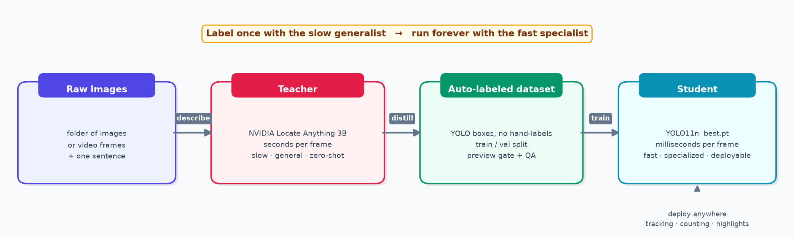
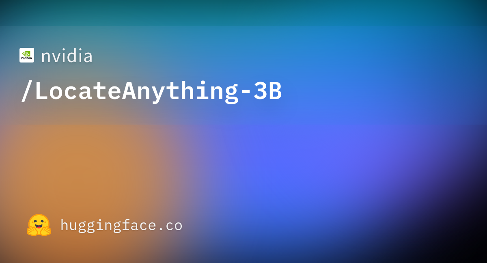
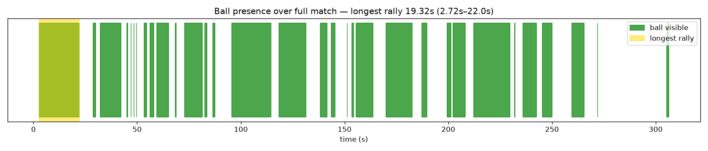
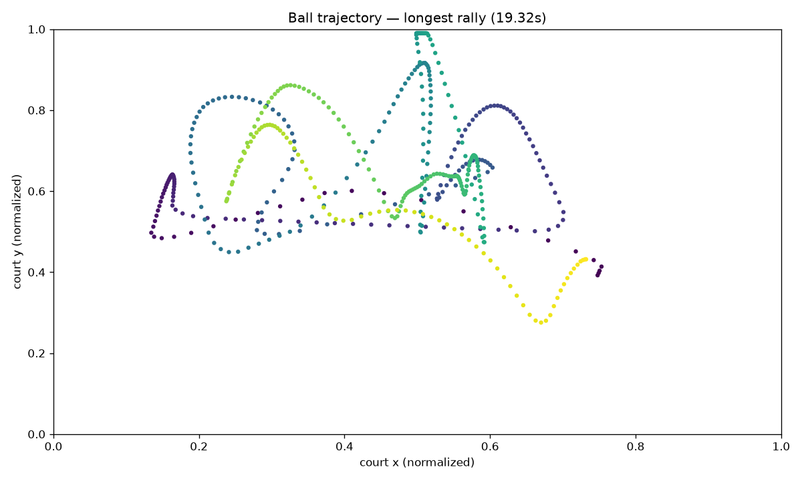

# YO-YOLO — Your Own YOLO

> One sentence + a folder of images → a fast, deployable detector. No manual labeling.

- **VISION-LANGUAGE MODEL** as teacher: `NVIDIA Locate Anything 3B` finds anything you can name and creates annotations. No human annotation required !!
- **DISTILLATION** : The annotated images enable training a `YOLO11n student` that runs ~55× faster (~11 ms vs ~600 ms).
- **AGENT SKILL**: the core of the code is a Markdown agent skill along with template python scripts, so you can just ask your agent to train your own YOLO with a /yo-yolo





## Special thanks
All of the code and even this README was written by agents via OpenCode, this project was a learning opportunity to see how fast it was possible to iterate on a small project like this one using 100% AI coding models. 
The idea for the project is mine, I thought it was really cool that NVIDIA has such a precise model for bounding boxes cause even recent Gemini VLMs which are quite good at image processing tasks have very vague bounding boxes (they are roughly on the object but not with a precise outline)

## The demo: finding highlights in a volleyball match

Imagine you have a full volleyball match replay and want highlight clips, but watching 5+ minutes to find every rally is tedious. The trick: a rally is simply a stretch where the ball is visible throughout — so if you can detect the ball in every frame, the highlights cut themselves. The catch is that the ball is tiny and the video is long, which is exactly what the demo below proves yo-yolo can handle. All of this needs a ball detector — which we don't have. Fortunately, yo-yolo builds you one: describe the ball in a sentence and the teacher model labels your training data, no hand annotation needed.

## Key numbers (volleyball demo)

| What | Number |
|---|---|
| Teacher → student speedup | **~55×** (606 ms → 10.9 ms/frame) |
| Student quality | **mAP50 0.59, precision 0.91** |
| Labeling cost | 512 frames, ~3 min, 273 boxes |
| Training cost | 30 epochs, ~2 min (RTX 5080) |
| Highlights found | **32 cuts**, longest **19.3 s** |

<video src="docs/volleyball/longest_rally_highlight.mp4" controls width="100%"></video>

## Example: volleyball highlights

Why this example? It is the hardest realistic case for the idea: the ball is
tiny (<15 px), blurred, often occluded — and the video is long (5.5 min), so
running the teacher on every frame (~80 min) is a non-starter. If distillation
works here, it works anywhere: a few minutes of teacher time buys a detector
that watches the whole match in ~2 min and cuts highlights on its own.

Full match replay (FRA vs ROC, Tokyo 2020 — 8,246 frames, 25 fps, 5.5 min).
The teacher is too slow for the whole video (~80 min), so:

- sample **512 frames** → teacher labels them (~3 min, 2 parallel streams)
- train **YOLO11n** (~2 min) → run it on **all 8,246 frames** (~2 min)
- track the ball (gap-fill ≤ 1 s, smooth) → cut **highlights**: stretches where the ball is visible throughout





Highlights + method in detail: [`example_log.md`](./example_log.md).
Full clip (19 s / 25 MB): `runs/volleyball_rally/rally/longest_rally.mp4`.

## Same pattern, other tasks

- other sports: `tennis ball`, `shuttlecock`, `player in red` + same cut logic
- counting: wildlife, packages, cells
- timelines: floor empty, stands full, machine idle
- reels: auto-cut highlights from any per-frame signal

## Use it

```bash
pip install -r requirements.txt
cp config.example.yaml config.yaml   # set images_dir, class_description, working_dir
python scripts/parse_dataset.py --config config.yaml
python scripts/preview_annotation.py --config config.yaml   # check preview_grid.png, refine prompt if off
python build_detector.py --config config.yaml               # --yes --no-review --no-dashboard
python scripts/track_rally.py --config config.yaml          # video recipe: dense inference -> segments -> clip
```

- Teacher: local CUDA (`nvidia/Locate-Anything-3B`) or endpoint (`locate_anything_endpoint: host:port`).
- Parallel labeling: `--workers 2` (start low — the server is the bottleneck).
- Inspect: `report.md`, Gradio `:7860`, Voxel51 `:5151`.

## Phases

| # | Phase | What it does |
|---|-------|--------------|
| 1 | Parse | Scan images, split train/val, derive a class name |
| 2 | Preview | Annotate 4 images — sanity-check the prompt |
| 3 | Annotate | Teacher over full dataset → YOLO labels |
| 4 | QA | Stats + validation |
| 5 | Review | *(optional)* Voxel51 |
| 6 | Train | YOLO11n + augmentations |
| 7 | Evaluate | mAP50 / mAP50-95 / P / R |
| 8 | Failure mining | Top teacher-vs-student disagreements |
| 9 | Report | Markdown report |
| 10 | Dashboard | Interactive web UI |

Outputs in `working_dir`: `manifest.json` · `preview_grid.png` · `dataset/`
· `qa_report.md` · `best.pt` / `last.pt` · `eval/metrics.json` · `failures/`
· `report.md` · `rally/` (clips, timelines, trajectories) · `logs/`

Agent workflow: [SKILL.md](./SKILL.md) · design/roadmap: [long_readme_foragents.md](./long_readme_foragents.md)
